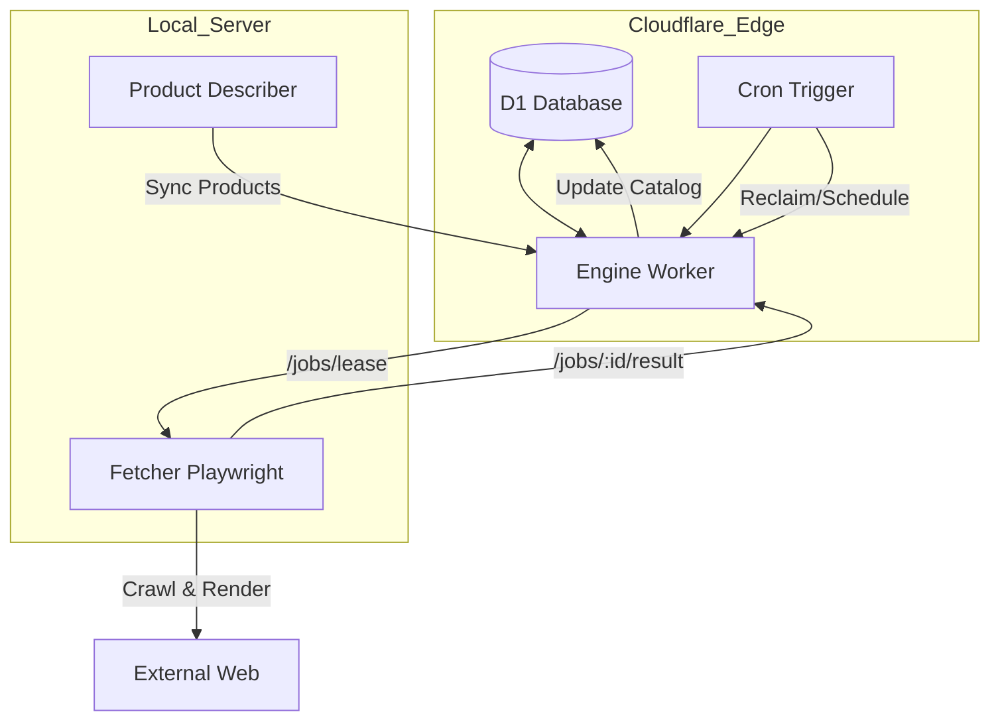
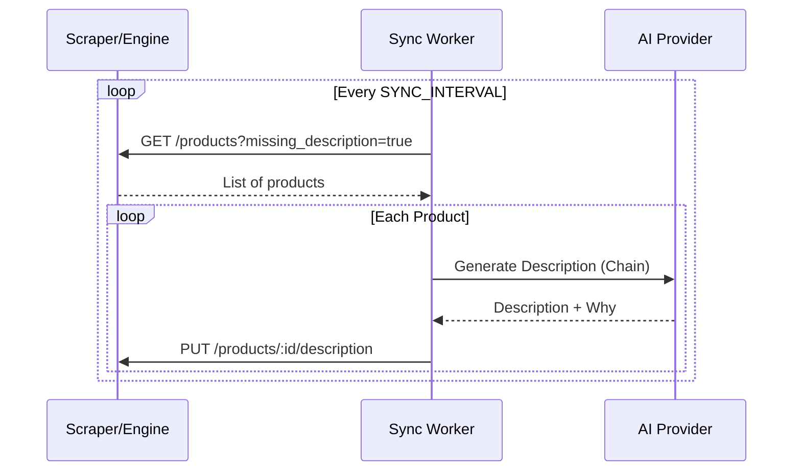

Relevant source files

The following files were used as context for generating this wiki page:

- [RESUME.md](RESUME.md)
- [app.py](app.py)
- [main.py](main.py)
- [AGENTS.md](AGENTS.md)
- [README.md](README.md)
- [CLAUDE.md](CLAUDE.md)

# Cloudflare Edge & Migration Architecture

The Cloudflare Edge & Migration Architecture represents a strategic shift in the product-describer project from a local, high-dependency infrastructure to a distributed, serverless model. This transition involves migrating core logic and data storage to Cloudflare Workers and D1 databases, effectively positioning Cloudflare as the "brain and memory" of the system while relegating local servers to stateless "fetcher" roles.

The architecture addresses hardware reliability issues—such as the failure of local appdata storage—by ensuring that critical catalog schemas and processing engines are hosted on Cloudflare's edge network. This move aims to minimize operational costs (using Gemini's free tier and Cloudflare's free browser rendering) while improving system resilience and accessibility through Cloudflare Tunnels.

Sources: [RESUME.md:1-5](RESUME.md#L1-L5), [RESUME.md:104-106](RESUME.md#L104-L106), [CLAUDE.md:10-15](CLAUDE.md#L10-L15)

## Unified Edge Architecture

The project has transitioned to a "Unified Architecture" where Cloudflare (CF) serves as the primary engine for job management and data persistence. The local environment now functions as a stateless Playwright-based fetcher that pulls tasks from the edge.

### System Components

The following table summarizes the roles of the core components in the edge-integrated architecture:

| Component | Role | Platform |
| :--- | :--- | :--- |
| **Engine** | Job management, API endpoints (lease, result, ingest) | Cloudflare Workers |
| **D1 Database** | Catalog storage, price history, and job queues | Cloudflare D1 |
| **Fetcher** | Local Playwright-based worker for scraping and rendering | Local Server (Docker) |
| **Product Describer** | Background worker for generating descriptions via AI | Local/Cloudflare |
| **Cloudflared** | Secure tunnel connecting local services to the edge | Local Server |

Sources: [RESUME.md:104-114](RESUME.md#L104-L114), [docker-compose.yml:1-35](docker-compose.yml#L1-L35)

### Core API Endpoints (Engine)
The Cloudflare Worker engine (hosted at `engine.denied.se`) provides several critical endpoints for the distributed architecture:
*  `POST /jobs/lease`: Allows fetchers to claim pending rendering or scraping jobs.
*  `POST /jobs/:id/result`: Submits completed data (e.g., source text, prices) back to the D1 database.
*  `POST /ingest`: Facilitates bulk data migration into the D1 catalog.
*  `GET /health`: Health check endpoint requiring an `X-API-Key`.

Sources: [RESUME.md:112-114](RESUME.md#L112-L114)

## Data Flow and Job Lifecycle

The system utilizes a pull-based mechanism where local fetchers lease jobs from the Cloudflare Engine. This ensures that the local server remains stateless and can be easily replaced or scaled without data loss.

*The diagram shows the interaction between the Cloudflare Edge components and the local stateless fetchers.*

Sources: [RESUME.md:104-118](RESUME.md#L104-L118), [app.py:530-550](app.py#L530-L550)

### Migration Phases
The transition to Cloudflare is executed in distinct phases:
1.  **Phase 1:** Apply D1 catalog schema and deploy the Engine Worker to a custom domain.
2.  **Phase 2:** Implement the stateless fetcher (Playwright) to communicate with the Engine via `lease` and `result` endpoints.
3.  **Phase 3:** Bulk migration of local Postgres data (products, source text, price history) to D1 using `POST /ingest`.
4.  **Phase 4:** Implementation of Edge-based Cron triggers (running every 5 minutes) to reclaim stale leases and schedule missing descriptions.

Sources: [RESUME.md:108-124](RESUME.md#L108-L124)

## Integration with Local Infrastructure

Despite the move to the edge, specific high-bandwidth or intensive tasks remain localized but tightly integrated via Cloudflare Tunnels and environment-based configurations.

### Cloudflare Tunnel Ingress
Local services like the scraper API and product describer UI are exposed through Cloudflare Tunnels (e.g., `scraper-api.denied.se`). This eliminates the need for open ports on the local firewall while maintaining connectivity to the Cloudflare-based Engine.

### Configuration and Secrets
The architecture relies on environment variables and encrypted storage for API keys.
*  **INGEST_API_KEY**: Used to authenticate local fetchers and migration scripts against the Cloudflare Engine.
*  **PROVIDER_CONFIG_MASTER_KEY**: A Fernet key used to encrypt saved AI provider keys at rest.
*  **CLOUDFLARE_API_TOKEN**: Required for deploying Workers and managing D1 via Wrangler.

Sources: [RESUME.md:108-112](RESUME.md#L108-L112), [app.py:65-75](app.py#L65-L75), [README.md:45-55](README.md#L45-L55)

### Sync Mode Logic
The `sync` mode (defined in `main.py` and `app.py`) bridges the gap between the scraper and the description generator. It polls the scraper (or edge engine) for items missing descriptions and writes back the AI-generated results.

*Sequence of the background synchronization process for enriching product data.*

Sources: [main.py:165-205](main.py#L165-L205), [app.py:530-565](app.py#L530-L565)

## Technical Implementation Details

### Edge Cron Jobs
The Cloudflare Worker includes a cron handler (`*/5`) that manages the lifecycle of edge data:
*  **reclaimLeases**: Resets jobs that were leased but never finished by a fetcher.
*  **scheduleDetailJobs**: Identifies products needing deep-crawling/rendering.
*  **describeMissing**: Triggers description generation for products with valid source text but missing descriptions.

Sources: [RESUME.md:120-123](RESUME.md#L120-L123)

### Local Fetcher Logic
The local fetcher (implemented in `fetcher.py` within the scraper repository) operates end-to-end against the live D1 database. It handles rendering tasks using Playwright to extract structured data (JSON-LD) or CSS-selected content from product pages.

Sources: [RESUME.md:112-114](RESUME.md#L112-L114), [RESUME.md:90-100](RESUME.md#L90-L100)

## Conclusion
The Cloudflare Edge & Migration Architecture successfully decouples data persistence and job management from local hardware, mitigating risks associated with local storage failures. By leveraging Cloudflare Workers, D1, and Tunnels, the system achieves a highly resilient, distributed state where the edge acts as the central coordinator and local resources act as specialized execution agents.

Sources: [RESUME.md:1-10](RESUME.md#L1-L10), [RESUME.md:104-106](RESUME.md#L104-L106)
