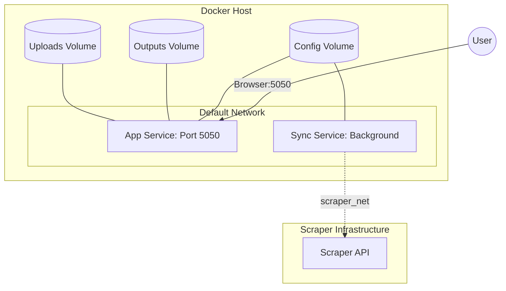
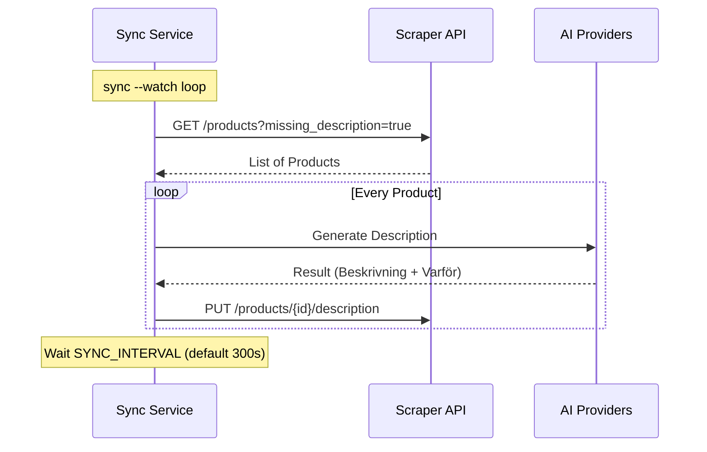

<details>
<summary>Relevant source files</summary>

The following files were used as context for generating this wiki page:

- [docker-compose.yml](docker-compose.yml)
- [README.md](README.md)
- [AGENTS.md](AGENTS.md)
- [CLAUDE.md](CLAUDE.md)
- [app.py](app.py)
- [main.py](main.py)
</details>

# Docker & Containerization Setup

The Docker and containerization setup for the **product-describer** project provides a portable, multi-tenant environment for generating Swedish product descriptions using various AI providers (Claude, OpenAI, Gemini). The architecture is designed to support both a manual web-based workflow and an automated synchronization workflow with external scraper APIs.

By leveraging Docker Compose, the system encapsulates the Flask web UI, background job runners, and synchronization workers. This setup ensures that environment-specific configurations, such as API keys and session secrets, are managed securely through environment variables and persistent volumes while maintaining isolation between different user accounts.
Sources: [AGENTS.md:15-18](AGENTS.md#L15-L18), [CLAUDE.md:15-18](CLAUDE.md#L15-L18), [README.md:18-20](README.md#L18-L20)

## Service Architecture

The system is defined by two primary services in the `docker-compose.yml` file. Both services utilize the same base image but perform different roles within the application ecosystem.

### Application Service (`app`)
The `app` service runs the main Flask web application and the job runner. It provides the multi-tenant interface where users can sign up, log in, and configure their own API keys.
*  **Image**: `ghcr.io/blixten85/product-describer:latest`
*  **Port Mapping**: Exposes port `5050` to the host.
*  **Functionality**: Handles file uploads (CSV, Excel, TXT, etc.), manages user accounts, and tracks background generation jobs.

### Synchronization Service (`sync`)
The `sync` service is an optional background worker activated via the `sync` Docker profile. It continuously polls an external scraper API for products missing descriptions.
*  **Command**: `python main.py sync --watch`
*  **Network Integration**: Connects to both the internal `default` network and an external `scraper_net` to facilitate direct communication with the scraper's database/API without a reverse proxy.

Sources: [docker-compose.yml:2-35](docker-compose.yml#L2-L35), [README.md:52-60](README.md#L52-L60)



The diagram shows the relationship between the internal services, persistent volumes, and the external scraper network.
Sources: [docker-compose.yml:2-45](docker-compose.yml#L2-L45), [README.md:60-66](README.md#L60-L66)

## Environment Configuration

The containerized environment requires specific variables to be set in a `.env` file or the host environment. Failure to provide mandatory keys will prevent the application from starting.

| Variable | Required | Description |
| :--- | :--- | :--- |
| `PROVIDER_CONFIG_MASTER_KEY` | **Yes** | Used to encrypt saved AI API keys at rest using Fernet. |
| `FLASK_SECRET_KEY` | **Yes** | Signs login session cookies to maintain stability across restarts. |
| `SYNC_ENABLED` | No | Enables the background worker within the main container or via the sync profile. |
| `SCRAPER_URL` | No | The internal Docker hostname for the scraper API (e.g., `http://scraper:8000`). |
| `SCRAPER_NETWORK` | No | Custom name for the external scraper network (defaults to `scraper_default`). |
| `GITHUB_ERROR_REPORT_TOKEN` | No | Enables automated error reporting to GitHub via a dedicated worker. |

Sources: [docker-compose.yml:9-12](docker-compose.yml#L9-L12), [README.md:28-44](README.md#L28-L44), [app.py:64-67](app.py#L64-L67)

### Key Generation Snippets
Before starting the containers, the following commands are used to generate the required secure keys:

```bash
# Generate PROVIDER_CONFIG_MASTER_KEY
python -c "from cryptography.fernet import Fernet; print(Fernet.generate_key().decode())"

# Generate FLASK_SECRET_KEY
python -c "import secrets; print(secrets.token_hex(32))"
```

Sources: [README.md:34-39](README.md#L34-L39), [docker-compose.yml:10-11](docker-compose.yml#L10-L11)

## Persistent Storage and Volumes

The setup uses three named volumes to ensure data persistence across container restarts and updates. These volumes are mapped to the internal `/app` directory.

1.  **`uploads`**: Stores files uploaded by users (e.g., CSV, Excel, PDF) before they are processed by the extractor.
2.  **`outputs`**: Contains generated CSV results and temporary job state files (`{job_id}_rows.json` and `_partial.json`).
3.  **`config`**: Holds user account databases (SQLite) and encrypted provider credentials. This volume is critical for multi-tenancy as it scopes provider config and jobs per `account_id`.

Sources: [docker-compose.yml:14-17](docker-compose.yml#L14-L17), [CLAUDE.md:46-51](CLAUDE.md#L46-L51), [app.py:73-74](app.py#L73-L74)

## Network Integration

The Synchronization mode requires the `product-describer` to join the network of the [scraper](https://github.com/blixten85/scraper) project. This is handled via an external network definition in the `docker-compose.yml`.



The sequence shows how the sync worker interacts with the scraper API and AI providers within the container network.
Sources: [main.py:126-150](main.py#L126-L150), [README.md:52-66](README.md#L52-L66)

## Operational Commands

When the system is running in Docker, specific CLI commands can be executed via `docker compose exec`.

*  **Manual One-shot Sync**:

```bash
    docker compose exec app python main.py sync --limit 50
    ```

*  **Running CLI for local files**:

```bash
    docker compose exec app python main.py run products.csv
    ```

Sources: [README.md:69-71](README.md#L69-L71), [AGENTS.md:33-36](AGENTS.md#L33-L36), [main.py:12-14](main.py#L12-L14)

## Summary
The Docker setup for the product-describer project facilitates a robust environment for both interactive and automated product description workflows. By separating concerns into an application service and a synchronization service, and leveraging persistent volumes for job state and encryption, the system achieves a secure, multi-tenant architecture that is easily integrated with external scraping tools.
Sources: [README.md:18-24](README.md#L18-L24), [CLAUDE.md:15-18](CLAUDE.md#L15-L18)
