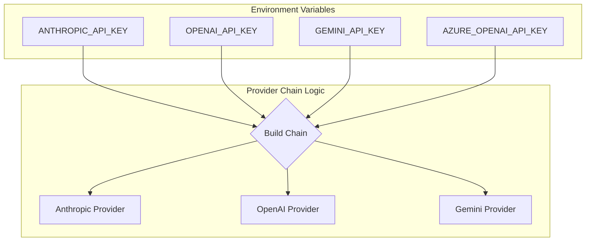

<details>
<summary>Relevant source files</summary>

The following files were used as context for generating this wiki page:

- [app.py](app.py)
- [main.py](main.py)
- [README.md](README.md)
- [docker-compose.yml](docker-compose.yml)
- [AGENTS.md](AGENTS.md)
- [CLAUDE.md](CLAUDE.md)
- [tests/test_provider_config.py](tests/test_provider_config.py)
</details>

# Environment Variables & Required Configuration

The Product Describer system relies on environment variables and configuration files to manage security, multi-tenant isolation, and integration with external LLM providers and scrapers. Configuration is split between global system settings required for the application to boot and provider-specific keys which can be managed via the Web UI or environment variables depending on the execution mode.

Sources: [README.md:37-56](README.md#L37-L56), [CLAUDE.md:20-30](CLAUDE.md#L20-L30)

## Core System Configuration

The application requires two critical security keys to be defined in the environment before it can start. These keys ensure session security and the protection of stored API credentials.

### Mandatory Security Variables
| Variable | Description | Requirement |
| :--- | :--- | :--- |
| `FLASK_SECRET_KEY` | Signs the login session cookie. Must be stable across restarts to prevent logging out users. | **Required** |
| `PROVIDER_CONFIG_MASTER_KEY` | A Fernet key used to encrypt saved API keys at rest. | **Required** |

Sources: [README.md:43-52](README.md#L43-L52), [app.py:59-60](app.py#L59-L60), [docker-compose.yml:10-11](docker-compose.yml#L10-L11)

### Security Key Generation
The project provides standard one-liners for generating these required values:

```bash
# Generate PROVIDER_CONFIG_MASTER_KEY
python -c "from cryptography.fernet import Fernet; print(Fernet.generate_key().decode())"

# Generate FLASK_SECRET_KEY
python -c "import secrets; print(secrets.token_hex(32))"
```

Sources: [README.md:45-48](README.md#L45-L48)

## Execution Modes & Provider Configuration

The system handles AI provider credentials differently based on whether it is running as a multi-tenant Web UI or as a standalone CLI/Sync tool.

### Web UI (Multi-tenant Mode)
In the Web UI, configuration is scoped to an `account_id`. Credentials for providers like Claude, OpenAI, and Gemini are saved as encrypted JSON blobs within the account's directory structure.
- **Storage Path:** `config/accounts/<account_id>/credentials/`
- **Failover Order:** Managed in `config/accounts/<account_id>/provider_order.json`

Sources: [CLAUDE.md:67-73](CLAUDE.md#L67-L73), [app.py:126-140](app.py#L126-L140)

### CLI and Sync Mode
The CLI (`main.py run`) and Sync mode are unrelated to user accounts and read provider keys directly from environment variables.



The diagram shows how the `ProviderChain` is constructed from environment variables for non-web execution.
Sources: [main.py:116-125](main.py#L116-L125), [CLAUDE.md:32-34](CLAUDE.md#L32-L34)

## Scraper & Sync Configuration

When `SYNC_ENABLED` is set to `true`, the system activates a background worker that polls an external scraper API for products missing descriptions.

### Sync Environment Variables
| Variable | Description | Default |
| :--- | :--- | :--- |
| `SYNC_ENABLED` | Enables the background sync worker. | `false` |
| `SCRAPER_URL` | The endpoint for the scraper service. | `http://scraper:8000` |
| `SCRAPER_API_KEY` | API key for authenticating with the scraper. | `""` |
| `SCRAPER_API_KEY_FILE` | Path to a file containing the scraper API key. | `""` |
| `SYNC_INTERVAL` | Seconds between polling cycles. | `300` |
| `SYNC_LIMIT` | Max number of products to process per batch. | `50` |
| `SCRAPER_NETWORK` | Docker network name for scraper integration. | `scraper_default` |

Sources: [README.md:73-86](README.md#L73-L86), [main.py:30-32](main.py#L30-L32), [app.py:461-465](app.py#L461-L465)

## Infrastructure & Maintenance

The system uses specific variables to control container behavior and data retention.

### Job and Session Management
- **Retention:** `JOB_RETENTION_DAYS` (Default: `30`) defines how long completed or failed jobs are kept before being purged from `uploads/` and `outputs/`.
- **Session Security:** `SESSION_COOKIE_SECURE` (Default: `1`) controls if cookies require HTTPS. Set to `0` for local development.
- **Resume Polling:** `RESUME_CHECK_INTERVAL` (Default: `120`) defines how often the system checks for paused jobs to resume after quota resets.

Sources: [app.py:64-70](app.py#L64-L70), [app.py:73](app.py#L73), [app.py:192-200](app.py#L192-L200)

### Error Reporting
- **GitHub Integration:** `GITHUB_ERROR_REPORT_TOKEN` allows the system to automatically open issues for unhandled exceptions if configured.
- **Sentry Integration:** `SENTRY_DSN` and `SENTRY_TRACES_SAMPLE_RATE` (Default: `1.0`) are used for performance monitoring and error tracking.

Sources: [app.py:32-52](app.py#L32-L52), [CLAUDE.md:83-88](CLAUDE.md#L83-L88), [docker-compose.yml:12](docker-compose.yml#L12)

## Summary
The Product Describer configuration is designed for security and flexibility. Global mandatory keys (`FLASK_SECRET_KEY`, `PROVIDER_CONFIG_MASTER_KEY`) ensure the integrity of the multi-tenant environment, while optional environment variables allow for seamless integration with AI providers and the Scraper ecosystem in headless modes. Proper configuration of volume mounts for `config/`, `uploads/`, and `outputs/` is essential for data persistence across container restarts.

Sources: [README.md:104-120](README.md#L104-L120), [docker-compose.yml:14-16](docker-compose.yml#L14-L16)
