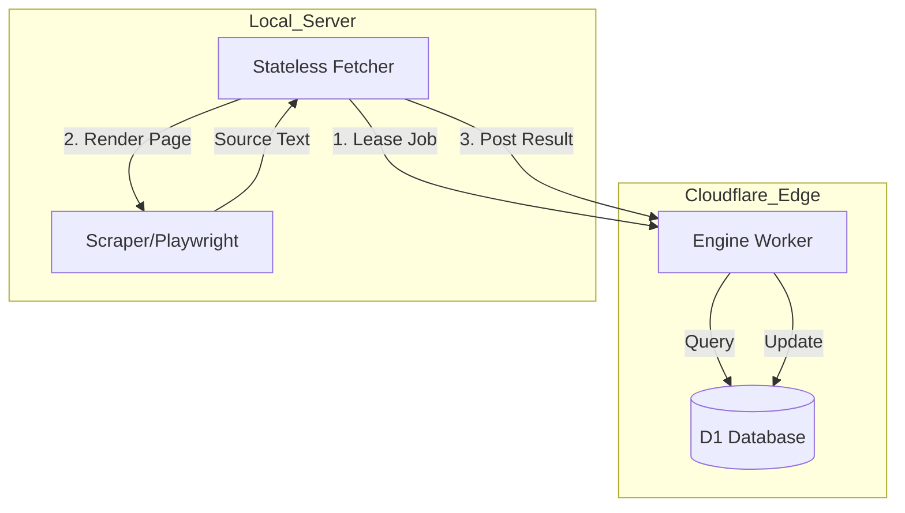
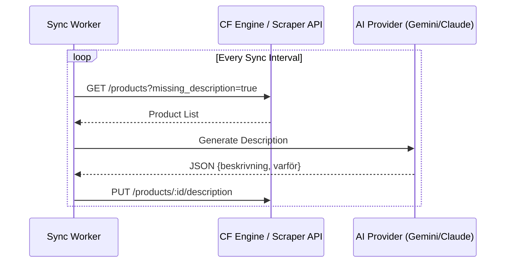

Relevant source files

The following files were used as context for generating this wiki page:

- [RESUME.md](RESUME.md)
- [README.md](README.md)
- [app.py](app.py)
- [main.py](main.py)
- [AGENTS.md](AGENTS.md)
- [CLAUDE.md](CLAUDE.md)

# Cloudflare Edge & Migration Architecture

## Introduction
The Cloudflare Edge & Migration Architecture represents a strategic shift in the `product-describer` project from a purely local, server-bound processing model to a distributed edge-computing model. This architecture leverages Cloudflare Workers and D1 databases to handle the "brain" (logic) and "memory" (storage) of the system, while the local server transitions into a stateless worker for data fetching and browser rendering.

The primary goal of this migration is to optimize costs and improve scalability by utilizing Cloudflare's global edge network for coordination while maintaining local control over resource-intensive tasks like Playwright-based scraping.

Sources: [RESUME.md:81-85](RESUME.md#L81-L85), [CLAUDE.md:1-15](CLAUDE.md#L1-L15)

## Unified Edge Architecture
The transition moves the system towards a model where Cloudflare acts as the central engine, managing job queues and product catalogs via D1, while a stateless "fetcher" running on a local server performs actual data retrieval.

### Architectural Components
The system is divided into functional layers across different environments:

*  **Cloudflare Engine (Edge):** Serves as the central coordinator. It manages the D1 database for product catalogs and job tracking.
*  **Fetcher (Local Server):** A stateless service that pulls (leases) jobs from the Engine, executes browser-based rendering via Playwright, and returns results.
*  **Sync Worker:** A background process that polls the scraper API or Cloudflare Engine to identify products missing descriptions and initiates the generation process.

Sources: [RESUME.md:81-98](RESUME.md#L81-L98), [app.py:535-575](app.py#L535-L575), [main.py:161-190](main.py#L161-L190)

### System Flow Diagram
The following diagram illustrates the interaction between the Cloudflare Engine and the stateless local fetcher.

*The diagram shows the lease-render-result lifecycle of a product description job.*
Sources: [RESUME.md:81-98](RESUME.md#L81-L98), [main.py:161-190](main.py#L161-L190)

## Migration Phases
The migration was executed in distinct phases to ensure system stability and data integrity during the transition from local PostgreSQL to Cloudflare D1.

| Phase | Status | Description |
| :--- | :--- | :--- |
| **Phase 1** | Completed | Applied D1 catalog schema; deployed Engine Worker to custom domain. |
| **Phase 2** | Completed | Implemented fetcher logic and verified end-to-end lease/render/result flow. |
| **Phase 3** | Ongoing | Migration of local PostgreSQL backlog (source_text/history) to D1 via `/ingest`. |
| **Phase 4** | Completed | Deployment of Cron jobs (*/5) in the Engine for job scheduling and description generation. |
| **Phase 5** | Planned | Implementation of Alerts and UI for edge-managed jobs. |
| **Phase 6** | Planned | Decommissioning of local PostgreSQL and Scraper API. |

Sources: [RESUME.md:100-117](RESUME.md#L100-L117)

## Data Synchronization and API Integration
A critical component of the migration is the `Sync Mode`, which allows the product describer to bridge local scraper data with edge processing.

### Sync Mode Logic
When `SYNC_ENABLED` is true, a background worker polls a configured `SCRAPER_URL` at defined intervals. It retrieves products missing descriptions and pushes generated content back to the scraper.

*Sequence of events for automated product description synchronization.*
Sources: [main.py:161-205](main.py#L161-L205), [app.py:535-575](app.py#L535-L575), [README.md:81-110](README.md#L81-L110)

### Engine API Endpoints
The Cloudflare Engine exposes several internal endpoints for the migration and ongoing operations:

| Endpoint | Method | Purpose |
| :--- | :--- | :--- |
| `/jobs/lease` | POST | Reserved for fetchers to claim pending rendering jobs. |
| `/jobs/:id/result` | POST | Submission point for completed scraping/rendering data. |
| `/ingest` | POST | High-volume data entry for migrating historical product data. |
| `/health` | GET | Health check, requiring `X-API-Key` authentication. |

Sources: [RESUME.md:104-106](RESUME.md#L104-L106)

## Security and Connectivity
Transitioning to an edge architecture requires robust security for cross-environment communication.

*  **Cloudflare Tunnels:** Used to expose the local Scraper API (e.g., `scraper-api.denied.se`) securely without opening public ports.
*  **API Authentication:** Both the local Scraper API and the Cloudflare Engine utilize `X-API-Key` headers.
*  **Secret Management:** Tokens like `INGEST_API_KEY` and `CLOUDFLARE_API_TOKEN` are managed via environment variables and Cloudflare Secrets (using `wrangler secret put`).

Sources: [RESUME.md:46-55](RESUME.md#L46-L55), [RESUME.md:101-103](RESUME.md#L101-L103), [docker-compose.yml:1-35](docker-compose.yml#L1-L35)

## Conclusion
The Cloudflare Edge & Migration Architecture shifts the `product-describer` from a monolithic local application to a resilient, distributed system. By centralizing the product catalog and job coordination in Cloudflare D1 and Workers, the project achieves greater separation of concerns, allowing the local infrastructure to focus exclusively on high-latency browser rendering tasks.

Sources: [RESUME.md:81-110](RESUME.md#L81-L110), [AGENTS.md:1-25](AGENTS.md#L1-L25)
