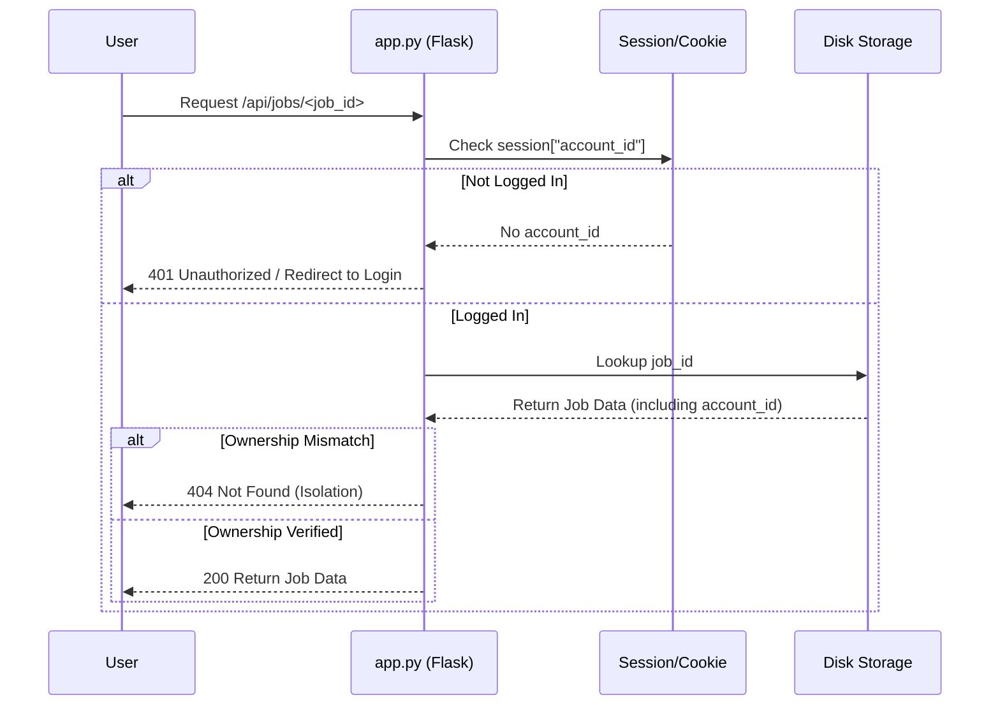

Relevant source files

The following files were used as context for generating this wiki page:

- [SECURITY.md](SECURITY.md)
- [app.py](app.py)
- [AGENTS.md](AGENTS.md)
- [CLAUDE.md](CLAUDE.md)
- [README.md](README.md)
- [github_report.py](github_report.py)

# Security Policy & Practices

## Introduction
The Product Describer system is designed as a multi-tenant application where security is centered on credential isolation, data privacy, and robust error handling. The system generates Swedish product descriptions using external AI providers (Anthropic, OpenAI, Google, Azure), requiring high standards for managing sensitive API keys and user session data.

The core security philosophy relies on "Bring Your Own Key" (BYOK), ensuring that the service operator does not incur financial responsibility for user API usage and that keys remain encrypted at rest. Furthermore, the system implements automated vulnerability reporting and strict data sanitization to prevent sensitive leaks in public logs or issue trackers.

Sources: [CLAUDE.md:12-14](CLAUDE.md#L12-L14), [README.md:27-31](README.md#L27-L31), [AGENTS.md:13-15](AGENTS.md#L13-L15)

## Credential Management & Encryption
Credential security is handled through environment variables and at-rest encryption. API keys and configuration data are never hardcoded or committed to version control.

### API Key Security
- **Encryption at Rest**: Saved API keys (Anthropic, OpenAI, etc.) are encrypted using Fernet (symmetric encryption) before being stored in the `config/` directory.
- **Master Key**: The `PROVIDER_CONFIG_MASTER_KEY` environment variable is required to encrypt and decrypt these keys. If this key is missing, the system refuses to start or returns errors when saving new keys.
- **CLI vs. Web UI**: The Web UI uses encrypted account-scoped storage, while CLI modes (`main.py run`/`sync`) read keys directly from environment variables for stateless execution.

Sources: [SECURITY.md:16-18](SECURITY.md#L16-L18), [AGENTS.md:52-60](AGENTS.md#L52-L60), [README.md:33-40](README.md#L33-L40)

### Configuration Requirements
| Variable | Purpose | Security Requirement |
| :--- | :--- | :--- |
| `PROVIDER_CONFIG_MASTER_KEY` | Encrypts API keys at rest | Must be a valid Fernet key; unique per installation |
| `FLASK_SECRET_KEY` | Signs session cookies | Must be a stable, high-entropy hex string |
| `ANTHROPIC_API_KEY` | CLI Auth for Claude | Passed via environment only |
| `OPENAI_API_KEY` | CLI Auth for GPT | Passed via environment only |

Sources: [README.md:43-52](README.md#L43-L52), [SECURITY.md:16-18](SECURITY.md#L16-L18)

## Authentication & Session Security
The system uses a Flask-based authentication mechanism to ensure multi-tenant isolation. 

### Session Protection
The application implements several cookie-level security flags to prevent common web attacks:
- **HTTPOnly**: Prevents JavaScript from accessing session cookies, mitigating XSS risks.
- **SameSite=Lax**: Restricts cookie transmission in cross-site POST requests to prevent CSRF.
- **Secure Flag**: Ensures cookies are only sent over HTTPS (configurable via `SESSION_COOKIE_SECURE`).

Sources: [app.py:61-68](app.py#L61-L68), [CLAUDE.md:73-76](CLAUDE.md#L73-L76)

### Multi-Tenant Isolation
Every request (except `/login` and `/signup`) is protected by a `@login_required` decorator. Data is strictly scoped to the `account_id` stored in the session:
- **Storage Paths**: Uploads and outputs are stored in account-specific subdirectories (e.g., `uploads/<account_id>/`).
- **Job Access**: Ownership is verified on every job lookup to prevent users from guessing job IDs to access other accounts' data.

Sources: [app.py:73-82](app.py#L73-L82), [CLAUDE.md:73-77](CLAUDE.md#L73-L77)

The diagram above illustrates how the system enforces multi-tenant isolation during a job request. Sources: [app.py:73-82](app.py#L73-L82), [app.py:382-386](app.py#L382-L386)

## Automated Vulnerability & Error Reporting
The system includes a specialized module, `github_report.py`, to handle unexpected exceptions without exposing sensitive data.

### Data Sanitization
Before reporting an error to GitHub, the system applies strict sanitization rules:
- **Secret Masking**: Any environment variable containing `KEY`, `TOKEN`, `SECRET`, `PASSWORD`, or `PASS` is masked in the output.
- **Pattern Matching**: Known credential formats (e.g., `sk-...`, `ghp_...`, `Bearer ...`) are automatically redacted.
- **PII Removal**: Email addresses are replaced with `[EMAIL REDACTED]` and home directory paths are generalized to `/home/[user]`.

Sources: [github_report.py:16-35](github_report.py#L16-L35), [github_report.py:53-62](github_report.py#L53-L62)

### Throttling & Deduplication
To prevent API abuse or log spamming, the reporter implements:
- **Fingerprinting**: Generates a SHA-256 hash of the exception type and location to identify duplicate issues.
- **Rate Limiting**: Limits reports to a configurable maximum (default 20) per window (default 1 hour).

Sources: [github_report.py:43-51](github_report.py#L43-L51), [github_report.py:65-72](github_report.py#L65-L72)

## Reporting Vulnerabilities
The project maintains a formal security policy for external researchers.

- **Private Reporting**: Vulnerabilities should be reported via GitHub's private reporting feature rather than public issues.
- **Response SLA**: The maintainers aim to respond within 48 hours.
- **Supported Versions**: Only the `latest` version is officially supported for security patches.

Sources: [SECURITY.md:1-14](SECURITY.md#L1-L14)

## Summary of Prohibited Practices
To maintain the security posture of the repository, the following constraints are enforced:
- **No Direct Pushes**: All changes must go through Pull Requests.
- **No Credential Commits**: Never commit `.env` files, `config/` files, or raw keys.
- **No Workflow Modification**: Secrets and CI/CD workflows are protected.

Sources: [AGENTS.md:83-93](AGENTS.md#L83-L93)

## Conclusion
The Product Describer architecture prioritizes credential safety through mandatory encryption and environment-based configuration. By leveraging multi-tenant session isolation and an automated, sanitized error reporting system, it ensures that both user API keys and private product data remain protected during processing. Users are encouraged to follow the `SECURITY.md` guidelines, particularly regarding the rotation of `PROVIDER_CONFIG_MASTER_KEY` and the use of private vulnerability reporting channels.
