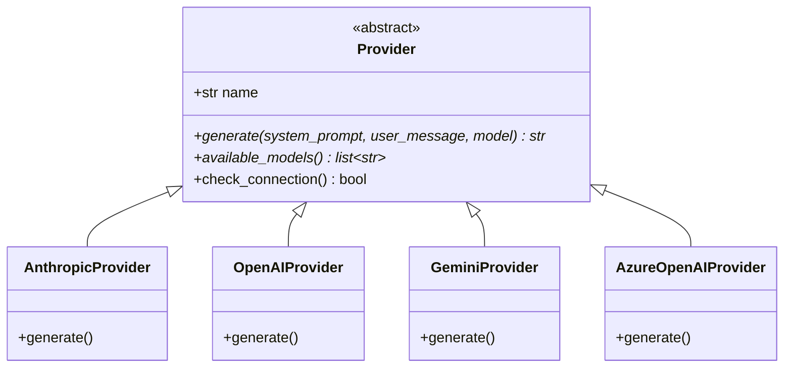
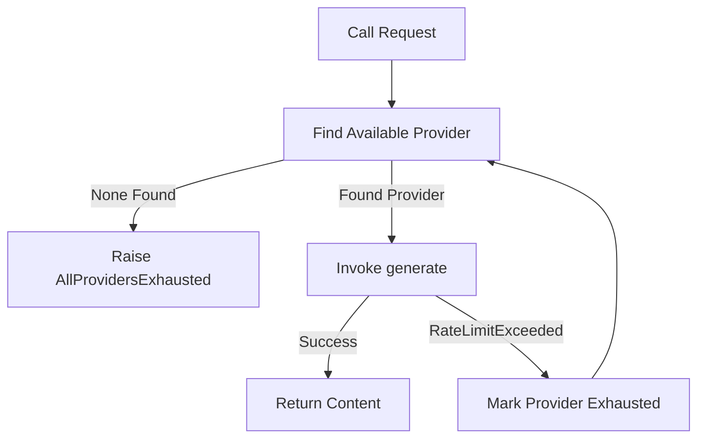
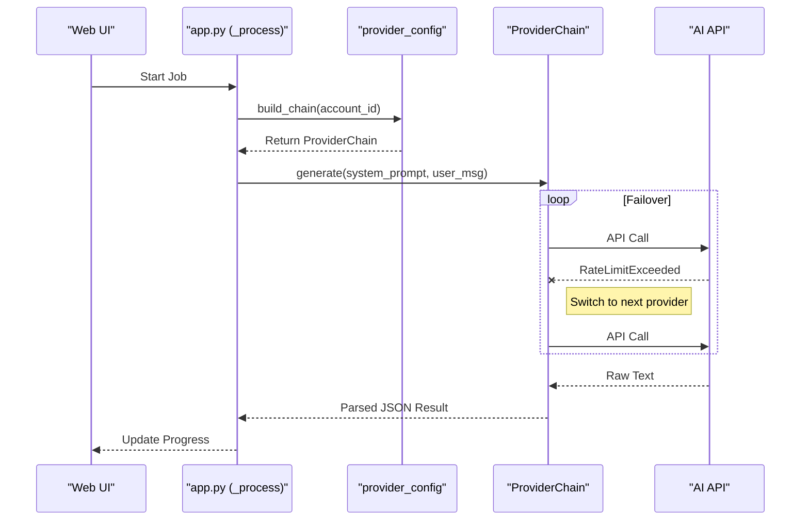

<details>
<summary>Relevant source files</summary>

The following files were used as context for generating this wiki page:

- [providers.py](providers.py)
- [provider\_config.py](provider_config.py)
- [CLAUDE.md](CLAUDE.md)
- [AGENTS.md](AGENTS.md)
- [app.py](app.py)
- [main.py](main.py)
</details>

# Extending AI Providers & Models

## Introduction
The `product-describer` system is designed with a highly modular architecture for integrating Large Language Models (LLMs) from various AI providers. The primary purpose of this architecture is to facilitate automatic failover between different AI services (e.g., Anthropic, OpenAI, Google) when rate limits or quotas are exceeded. This ensures high availability and continuous processing of product descriptions without manual intervention.

Sources: [providers.py:1-9](providers.py#L1-L9), [README.md:65-71](README.md#L65-L71)

The system abstracts individual AI services into `Provider` subclasses, which are managed by a `ProviderChain`. This chain handles the logic of trying providers in a prioritized order and tracking exhaustion states (waiting for quota resets). This extensible framework allows developers to add new AI providers by implementing a standard interface and registering them in the configuration.

Sources: [providers.py:270-281](providers.py#L270-L281), [AGENTS.md:57-61](AGENTS.md#L57-L61)

## Provider Architecture

The architecture relies on an abstract base class that defines how to communicate with an AI model, coupled with a configuration layer that manages API keys and model selections.

### The Provider Interface
Every AI service integration must inherit from the `Provider` abstract base class. This ensures that the rest of the application can interact with any AI service using a unified set of methods.



The diagram above shows the class hierarchy for AI providers within the system.
Sources: [providers.py:53-76](providers.py#L53-L76)

### Key Components of a Provider
| Method/Attribute | Description |
| :--- | :--- |
| `name` | A unique string identifier for the provider (e.g., "anthropic"). |
| `generate()` | The core method that sends prompts to the API and returns raw text content. It must raise `RateLimitExceeded` for 429 errors or quota issues. |
| `available_models()`| Returns a list of supported model strings for that provider. |
| `check_connection()`| Validates that the provider is functional, usually by attempting to list models. |

Sources: [providers.py:56-76](providers.py#L56-L76)

## Failover and Chain Management

The `ProviderChain` is responsible for orchestrating multiple providers. It maintains an ordered list of `ProviderSpec` objects, each containing a provider instance and a specific model ID.

### The Failover Logic
When a request is made through the `ProviderChain`, it iterates through available providers. If a provider raises a `RateLimitExceeded` exception, the chain catches it, records the time when the provider is expected to be available again (the `resume_at` timestamp), and immediately attempts the request with the next provider in the list.



The flowchart illustrates how the ProviderChain handles request execution and automatic failover.
Sources: [providers.py:270-323](providers.py#L270-L323)

### Exhaustion States
Providers are marked as exhausted until a specific time. If the API provides a `Retry-After` header, that value is used; otherwise, the system defaults to the next UTC midnight (or 6 hours for billing-related errors).

Sources: [providers.py:228-261](providers.py#L228-L261)

## Configuration and Registration

To add a new provider to the system, specific entries must be added to `provider_config.py`. This registration allows the Web UI and CLI to recognize and utilize the new service.

### Registration Requirements
1.  **PROVIDER_CLASSES**: Map the provider's unique name to its Python class.
2.  **DEFAULT_MODELS**: Define a default model string to use if the user hasn't specified one.
3.  **PROVIDER_LABELS**: Provide a human-readable string for the Web UI.
4.  **EXTRA_FIELDS (Optional)**: Define additional configuration fields required for the provider (e.g., Azure OpenAI requires `endpoint` and `deployment`).

Sources: [provider_config.py:34-60](provider_config.py#L34-L60), [AGENTS.md:57-61](AGENTS.md#L57-L61)

### Handling Extra Fields
Some providers require more than just an API key. For example, Azure OpenAI requires a deployment name and a resource endpoint. These are defined in the `EXTRA_FIELDS` dictionary and are automatically picked up by the settings UI.

| Provider | Extra Field | Description |
| :--- | :--- | :--- |
| `azure_openai` | `endpoint` | The full URL for the Azure OpenAI resource. |
| `azure_openai` | `deployment` | The specific deployment name configured in Azure. |

Sources: [provider_config.py:52-57](provider_config.py#L52-L57), [providers.py:175-182](providers.py#L175-L182)

## Data Flow: Web UI to Provider

The following sequence diagram demonstrates how a request from the user interface flows through the background job processor into the provider chain.



This diagram shows the end-to-end flow of generating a description, including the internal failover loop.
Sources: [app.py:195-255](app.py#L195-L255), [providers.py:307-320](providers.py#L307-L320)

## Implementation Example: Adding a Provider

To extend the system, a developer creates a subclass in `providers.py`:

```python
class NewAIProvider(Provider):
    name = "new_ai"
    
    def __init__(self, api_key: str):
        self._api_key = api_key

    def generate(self, system_prompt, user_message, model):
        try:
            # Implementation of API call using specific SDK
            pass
        except Exception as e:
            if "rate_limit" in str(e):
                raise RateLimitExceeded(self.name)
            raise

    def available_models(self):
        return ["model-v1", "model-v2"]
```

Sources: [providers.py:79-110](providers.py#L79-L110) (Pattern based on `AnthropicProvider`)

## Summary
The system provides a robust framework for extending AI capabilities through inheritance and centralized configuration. By implementing the `Provider` interface and registering the class, new models and services can be integrated with full support for the project's automatic failover and multi-tenant key management systems. This architecture prioritizes resilience, ensuring that large-scale product description jobs continue even during service outages or rate limit hits.

Sources: [CLAUDE.md:14-20](CLAUDE.md#L14-L20), [providers.py:1-9](providers.py#L1-L9)
