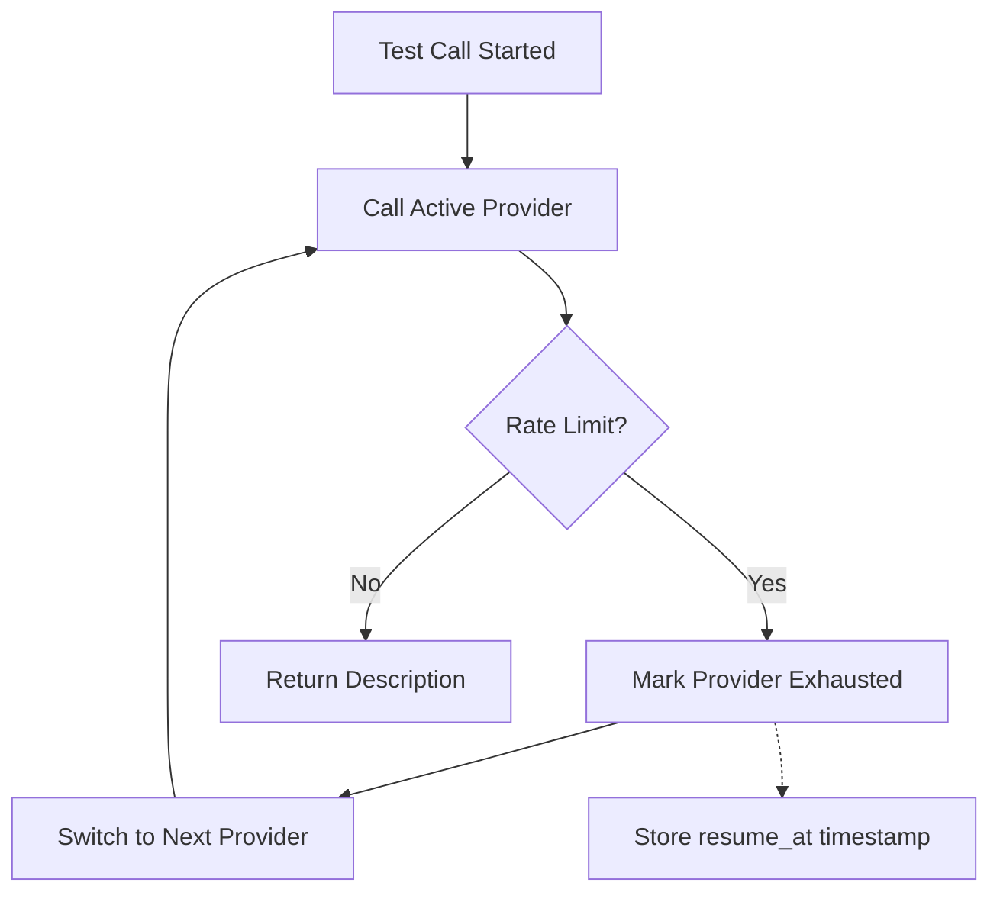
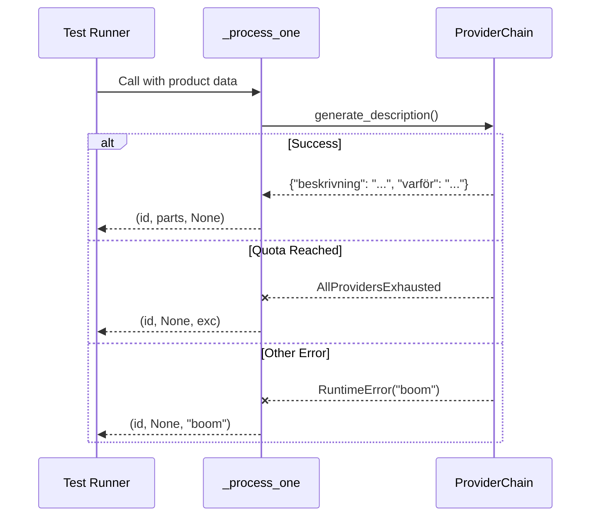

Relevant source files

The following files were used as context for generating this wiki page:

- [tests/test_main.py](tests/test_main.py)
- [tests/test_providers.py](tests/test_providers.py)
- [tests/test_extractors.py](tests/test_extractors.py)
- [tests/test_github_report.py](tests/test_github_report.py)
- [main.py](main.py)
- [providers.py](providers.py)
- [CLAUDE.md](CLAUDE.md)

# Testing Suite Overview

The product-describer testing suite is a comprehensive validation framework built using `pytest`. Its primary purpose is to ensure the reliability of product data extraction, the integrity of the multi-provider AI failover logic, and the security of error reporting mechanisms. The suite utilizes unit tests and extensive mocking to simulate API behaviors and file system interactions without requiring live AI provider credentials.

The testing architecture mirrors the modular structure of the project, with specific test files dedicated to the CLI entry points (`main.py`), the AI provider abstractions (`providers.py`), data parsing logic (`extractors.py`), and utility modules. Developers can execute the entire suite using the `pytest` command as part of the standard development workflow.
Sources: [CLAUDE.md:27-31](CLAUDE.md#L27-L31), [tests/test_main.py:1-5](tests/test_main.py#L1-L5)

## Core Test Modules

The suite is organized into several key modules, each focusing on a specific functional area of the application.

### AI Provider and Failover Testing
The `tests/test_providers.py` module validates the `ProviderChain` logic, which is critical for the application's stability when handling rate limits. It uses a `FakeProvider` to simulate various API responses and failure states, ensuring that the system correctly transitions between providers when a `RateLimitExceeded` exception occurs.

This diagram illustrates the failover logic validated in the provider tests, specifically how the chain handles exhausted quotas.
Sources: [tests/test_providers.py:14-30](tests/test_providers.py#L14-L30), [providers.py:284-309](providers.py#L284-L309)

### Data Extraction and Parsing
The `tests/test_extractors.py` module ensures that the application can correctly handle both structured (CSV) and unstructured (TXT, PDF, DOCX) input formats. It verifies that AI-assisted extraction is triggered when necessary and that appropriate errors (`ExtractionError`) are raised for unsupported formats or malformed AI responses.

| Test Case | Target Function | Purpose |
| :--- | :--- | :--- |
| `test_parses_csv_directly` | `extract_rows` | Validates direct parsing of CSV files without AI. |
| `test_txt_requires_chain` | `extract_rows` | Ensures AI chain is provided for unstructured text. |
| `test_txt_uses_chain_to_extract` | `extract_rows` | Validates AI-assisted item extraction from text. |
| `test_unsupported_extension` | `extract_rows` | Ensures `ExtractionError` on invalid file types. |

Sources: [tests/test_extractors.py:6-48](tests/test_extractors.py#L6-L48), [extractors.py](extractors.py)

## CLI and Batch Processing Logic
Tests in `tests/test_main.py` focus on the core processing functions used by the CLI and background workers. This includes URL parsing, CSV loading, and the orchestration of the `_process_one` function, which serves as the unit of work for parallel processing.

### Processing Workflow Validation
The suite verifies the `_process_one` function's ability to handle three distinct outcomes:
1.  **Success**: Returns the product ID and generated description parts.
2.  **Provider Exhaustion**: Correctly catches `AllProvidersExhausted` and propagates the `resume_at` time.
3.  **General Errors**: Catches unexpected exceptions and returns them as error strings to prevent worker crashes.

Sources: [tests/test_main.py:53-87](tests/test_main.py#L53-L87), [main.py:157-171](main.py#L157-L171)

## Security and Error Reporting
The `tests/test_github_report.py` module is dedicated to verifying that sensitive information is never leaked during automated error reporting. It tests the `_redact` utility to ensure that:
*  Environment variable values (API keys) are replaced with `[REDACTED]`.
*  Email addresses are scrubbed.
*  Local file system paths (e.g., `/home/user/`) are generalized.
*  GitHub tokens are identified and removed via pattern matching.

It also validates the throttling mechanism to prevent spamming GitHub Issues during a crash loop, ensuring no more than a set number of reports are sent per time window.
Sources: [tests/test_github_report.py:7-40](tests/test_github_report.py#L7-L40), [tests/test_github_report.py:58-75](tests/test_github_report.py#L58-L75)

## Key Test Classes and Mocking Strategy

The testing suite relies heavily on `unittest.mock.MagicMock` to isolate components.

*  **`FakeProvider`**: A specialized mock class in `tests/test_providers.py` that allows tests to control exactly how many times a provider fails before succeeding.
*  **`tmp_path`**: A standard pytest fixture used extensively in `test_main.py` and `test_extractors.py` to create temporary file system structures for testing file I/O operations safely.
*  **Monkeypatching**: Used in `test_github_report.py` to simulate different environment variable configurations and network failure scenarios for the `requests` library.

Sources: [tests/test_providers.py:14-27](tests/test_providers.py#L14-L27), [tests/test_main.py:16-20](tests/test_main.py#L16-L20), [tests/test_github_report.py:44-55](tests/test_github_report.py#L44-L55)

## Summary of Testing Scope
The testing suite provides end-to-end verification of the backend logic, from the moment a file is uploaded or synced from the scraper, through the AI generation process with failover support, to the final CSV output generation and error handling. This ensures that the application remains robust across different AI providers and input data qualities.
