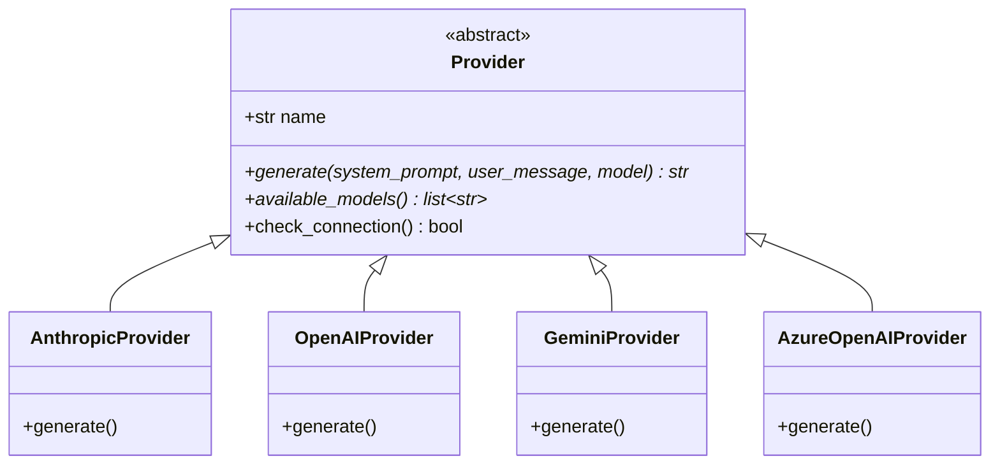
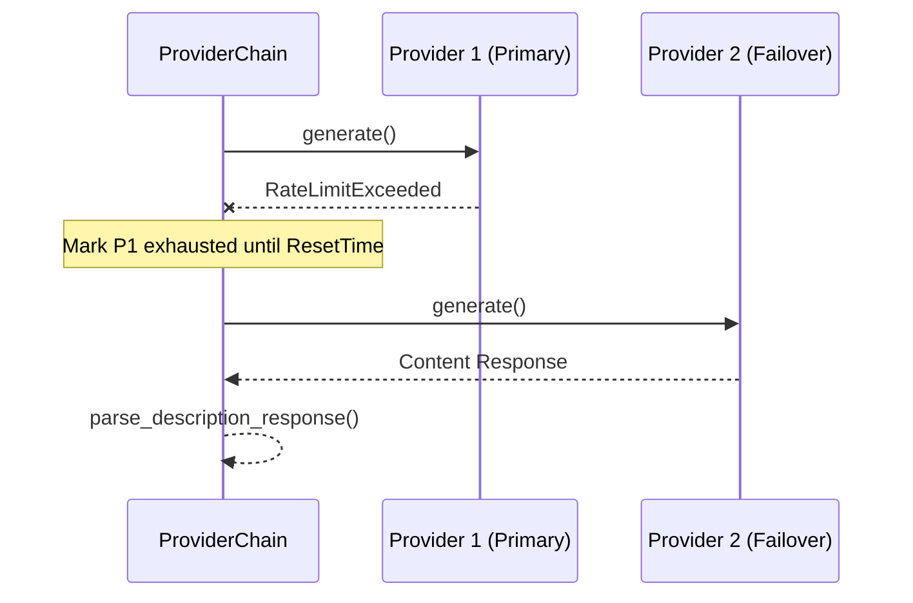

<details>
<summary>Relevant source files</summary>

The following files were used as context for generating this wiki page:

- [providers.py](providers.py)
- [provider\_config.py](provider_config.py)
- [AGENTS.md](AGENTS.md)
- [app.py](app.py)
- [main.py](main.py)
- [CLAUDE.md](CLAUDE.md)
</details>

# Extending AI Providers & Models

The product-describer system is designed with a modular architecture that allows for the integration of multiple AI providers. Its primary purpose is to generate Swedish product descriptions while maintaining high availability through an automatic failover mechanism called the `ProviderChain`. This system ensures that if one provider's API key is exhausted or rate-limited, the application seamlessly switches to the next configured provider.

The scope of "Extending AI Providers & Models" involves creating new subclasses of the base `Provider` class, configuring their default models, and ensuring they are recognized by the web UI and CLI components. The architecture isolates provider-specific SDK logic within `providers.py` while managing configuration and priority in `provider_config.py`.

Sources: [providers.py:1-12](providers.py#L1-L12), [AGENTS.md:4-10](AGENTS.md#L4-L10), [CLAUDE.md:46-52](CLAUDE.md#L46-L52)

## Provider Architecture

The system uses an abstraction layer to treat different AI services (Anthropic, OpenAI, Google, Azure) uniformly. Each provider is a concrete implementation of an abstract base class.

### The Provider Base Class
All AI integrations must inherit from the `Provider` abstract base class located in `providers.py`. This class defines the interface for generating content and checking connectivity.



The diagram above illustrates the inheritance hierarchy where specialized providers implement the abstract `generate` and `available_models` methods.
Sources: [providers.py:49-74](providers.py#L49-L74)

### Implementation Requirements
To add a new provider, the following steps are required:
1.  **Subclassing**: Create a new class in `providers.py` inheriting from `Provider`.
2.  **SDK Integration**: Implement `generate` using the specific provider's Python SDK (e.g., `anthropic`, `openai`, or `google.genai`).
3.  **Error Handling**: The `generate` method **must** catch provider-specific rate limit exceptions and raise a unified `RateLimitExceeded` exception.

Sources: [providers.py:53-58](providers.py#L53-L58), [AGENTS.md:46-52](AGENTS.md#L46-L52)

## ProviderChain and Failover Logic

The `ProviderChain` is the core engine responsible for orchestrating multiple providers. It maintains an ordered list of `ProviderSpec` objects and handles the logic for switching between them when errors occur.

### Failover Sequence
When a request is made, the `ProviderChain` attempts to use the highest-priority available provider. If a `RateLimitExceeded` error is encountered, it marks that provider as "exhausted" until a calculated reset time and moves to the next one.



This diagram shows the automatic failover process triggered by a rate limit error.
Sources: [providers.py:230-264](providers.py#L230-L264), [README.md:65-74](README.md#L65-L74)

### Reset Calculations
The system calculates when an exhausted provider can be retried using two strategies:
*  **Retry-After Header**: If the API provides a `retry-after` hint, it is honored.
*  **Default Guess**: If no hint is provided (common for billing/quota issues), the system guesstimates a 6-hour wait or waits until the next UTC midnight.

Sources: [providers.py:175-184](providers.py#L175-L184), [providers.py:202-211](providers.py#L202-L211)

## Configuration and Metadata

Adding a provider requires updating metadata in `provider_config.py` to ensure the web UI and configuration logic recognize the new service.

### Metadata Requirements
| Constant | Purpose | File Reference |
| :--- | :--- | :--- |
| `PROVIDER_CLASSES` | Maps internal IDs to class constructors. | [provider_config.py:33-38](provider_config.py#L33-L38) |
| `DEFAULT_MODELS` | Defines the default model ID for new configurations. | [provider_config.py:40-45](provider_config.py#L40-L45) |
| `PROVIDER_LABELS` | Human-readable names shown in the UI. | [providers.py:77-82](providers.py#L77-L82) |
| `EXTRA_FIELDS` | Defines non-API key requirements (e.g., Azure Endpoints). | [provider_config.py:50-56](provider_config.py#L50-L56) |

### Managing Extra Fields
Some providers require more than just an API key. For example, `AzureOpenAIProvider` requires an `endpoint` and a `deployment`. These are defined in `EXTRA_FIELDS` and processed dynamically by the Flask frontend and the configuration backend.

Sources: [provider_config.py:50-56](provider_config.py#L50-L56), [app.py:284-301](app.py#L284-L301)

## Integration with CLI and Web UI

The project supports two distinct modes of operation, each handling provider extension differently.

### Web UI Mode (Multi-tenant)
In the web interface (`app.py`), provider configurations are account-scoped and encrypted at rest using a Fernet master key (`PROVIDER_CONFIG_MASTER_KEY`).
*  **Settings Path**: `config/accounts/<account_id>/credentials/`
*  **Order Storage**: `config/accounts/<account_id>/provider_order.json`

Sources: [CLAUDE.md:38-42](CLAUDE.md#L38-L42), [provider_config.py:20-25](provider_config.py#L20-L25)

### CLI and Sync Mode
The CLI (`main.py`) bypasses the account system and reads keys directly from environment variables. To extend a provider for CLI use, its environment variable mapping must be added to `build_chain_from_env()`.

```python
# Example from provider_config.py:207-224
def build_chain_from_env() -> ProviderChain | None:
    specs = []
    for name in PROVIDER_CLASSES:
        api_key = os.getenv(f"{name.upper()}_API_KEY", "")
        if not api_key:
            continue
        # ... logic for extra env vars like AZURE_OPENAI_ENDPOINT ...
        provider = PROVIDER_CLASSES[name](api_key, **extra)
        specs.append(ProviderSpec(provider=provider, model=DEFAULT_MODELS[name]))
```

Sources: [provider_config.py:207-224](provider_config.py#L207-L224), [main.py:101-111](main.py#L101-L111)

## Summary of Extension Workflow

To successfully extend the system with a new AI Provider:
1.  **Define the Provider**: Implement a new class in `providers.py` with specific SDK logic.
2.  **Map Exceptions**: Ensure API-specific errors are converted to `RateLimitExceeded`.
3.  **Register Class**: Add the class to `PROVIDER_CLASSES` in `provider_config.py`.
4.  **Define Defaults**: Set a default model in `DEFAULT_MODELS`.
5.  **UI Labels**: Add a user-friendly label to `PROVIDER_LABELS`.
6.  **Environment Setup**: Update `build_chain_from_env` to support CLI usage via environment variables.

This structured approach ensures that the new provider participates in the global failover chain and is immediately available to users via the "Inställningar" (Settings) menu in the web interface.

Sources: [AGENTS.md:46-52](AGENTS.md#L46-L52), [CLAUDE.md:46-52](CLAUDE.md#L46-L52), [provider_config.py:207-224](provider_config.py#L207-L224)
