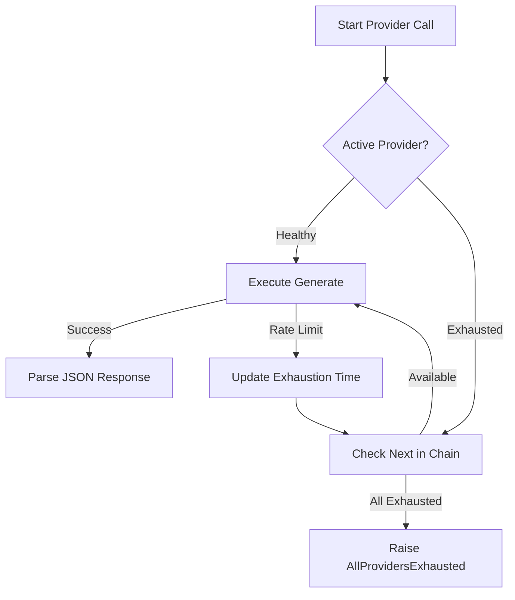
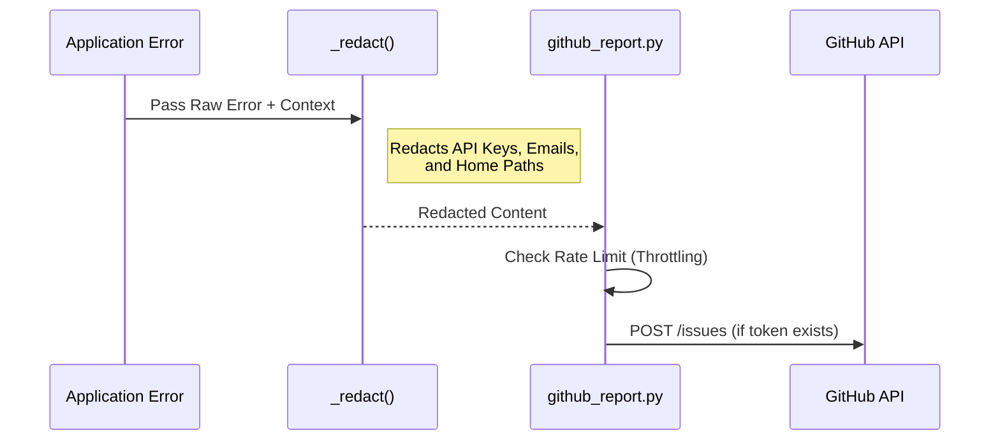

Relevant source files

The following files were used as context for generating this wiki page:

- [tests/test\_extractors.py](tests/test_extractors.py)
- [tests/test\_github\_report.py](tests/test_github_report.py)
- [tests/test\_main.py](tests/test_main.py)
- [tests/test\_provider\_config.py](tests/test_provider_config.py)
- [tests/test\_providers.py](tests/test_providers.py)
- [AGENTS.md](AGENTS.md)
- [CLAUDE.md](CLAUDE.md)

# Testing Suite Overview

The Testing Suite for the product-describer project is a comprehensive collection of automated tests built using the `pytest` framework. It is designed to ensure the reliability and accuracy of core functionalities, including AI provider failover logic, data extraction from various file formats, configuration management, and error reporting mechanisms. The suite utilizes unit tests and extensive mocking to isolate components, particularly when interacting with external AI APIs or the local filesystem.

The primary goal of the testing suite is to validate the project requirements, such as ensuring that all tests pass before deployment and maintaining technical accuracy across the multi-provider failover system. It covers critical path scenarios, such as successful product description generation, as well as edge cases like API rate limiting, billing exhaustion, and malformed input handling.

Sources: [AGENTS.md:55-57](AGENTS.md#L55-L57), [CLAUDE.md:83-85](CLAUDE.md#L83-L85), [tests/test_providers.py:1-10](tests/test_providers.py#L1-L10)

## Core Testing Modules

The testing suite is organized into specific modules that correspond to the application's internal architecture. Each module targets a specific set of responsibilities.

### AI Provider and Failover Testing
The `test_providers.py` module focuses on the `Provider` abstraction and the `ProviderChain` logic. It validates that the system correctly identifies rate limits and switches between providers (Claude, OpenAI, Gemini, Azure) without losing job progress.

Key aspects tested include:
*  **JSON Parsing**: Ensuring AI responses are correctly parsed into `beskrivning` and `varför` fields, even when embedded in conversational text.
*  **Failover Logic**: Verifying that a `ProviderChain` moves to the next available provider when a `RateLimitExceeded` exception is raised.
*  **Billing Awareness**: Identifying specific error messages related to low credit balances as a form of exhaustion.

The diagram above illustrates the logic validated by `TestProviderChain`, where the system attempts to find a healthy provider before failing.
Sources: [tests/test_providers.py:46-125](tests/test_providers.py#L46-L125), [providers.py:180-210](providers.py#L180-L210)

### Configuration and Account Isolation
The `test_provider_config.py` module ensures that API keys and settings are stored securely and isolated between different user accounts. It uses `pytest` fixtures to mock the configuration directory and environment variables.

| Test Class | Focus Area | Description |
| :--- | :--- | :--- |
| `TestApiKeyRoundTrip` | Data Persistence | Validates that keys are correctly saved, retrieved, and stripped of whitespace. |
| `TestMissingMasterKey` | Encryption Security | Ensures that setting new keys fails if the `PROVIDER_CONFIG_MASTER_KEY` is missing. |
| `TestExtraFields` | Azure Config | Validates that Azure-specific fields (endpoint, deployment) are required for a "ready" status. |
| `TestBuildChain` | Chain Assembly | Tests the logic for constructing a `ProviderChain` from stored account settings. |

Sources: [tests/test_provider_config.py:23-145](tests/test_provider_config.py#L23-L145), [CLAUDE.md:61-69](CLAUDE.md#L61-L69)

### Data Extraction Testing
The `test_extractors.py` module validates the logic for turning uploaded files (CSV, TXT, etc.) into structured product rows. It distinguishes between structured formats (CSV) and unstructured formats that require AI assistance (TXT, PDF).

*  **CSV Extraction**: Directly reads rows and fieldnames.
*  **AI-Assisted Extraction**: Mocks the AI chain to verify that unstructured text is correctly converted into JSON product lists.
*  **Error Handling**: Ensures that unsupported file extensions or unparseable AI responses trigger an `ExtractionError`.

Sources: [tests/test_extractors.py:8-48](tests/test_extractors.py#L8-L48), [AGENTS.md:33-33](AGENTS.md#L33)

### Error Reporting and Redaction
The `test_github_report.py` module validates the system's ability to report unexpected exceptions to GitHub while strictly redacting sensitive information.

Sources: [tests/test_github_report.py:7-38](tests/test_github_report.py#L7-L38), [CLAUDE.md:76-81](CLAUDE.md#L76-L81)

## CLI and Sync Logic Validation
The `test_main.py` module tests the command-line interface logic, including file loading and the "sync" mode which integrates with external scraper APIs.

### Key Functionality Tests
1.  **URL Processing**: `_site_from_url` is tested to ensure it correctly extracts domains (e.g., `exempel.se`) from full URLs.
2.  **Product Processing**: `_process_one` validates the handling of successful generations, provider exhaustion, and general runtime exceptions within the worker threads.
3.  **CSV Loading**: Ensures that `load_csv` correctly handles encoding and missing file errors.

Sources: [tests/test_main.py:38-48](tests/test_main.py#L38-L48), [tests/test_main.py:65-103](tests/test_main.py#L65-L103)

## Technical Requirements for Tests
The project enforces strict guidelines for the testing suite to maintain code quality:
*  **Isolation**: No tests should commit credentials or interact with live AI billing tiers.
*  **Environment**: Secrets like `ANTHROPIC_API_KEY` are passed via environment variables during CLI tests.
*  **Coverage**: All PRs require that "All tests must pass" before merging.

Sources: [SECURITY.md:14-17](SECURITY.md#L14-L17), [AGENTS.md:73-73](AGENTS.md#L73), [CLAUDE.md:38-40](CLAUDE.md#L38-L40)

## Summary
The product-describer testing suite provides a robust safety net for the application's complex failover and multi-tenant configuration systems. By utilizing comprehensive mocking and modular test files, it ensures that changes to one provider's SDK or a change in the data extraction logic do not negatively impact the rest of the system. The suite is a critical component of the CI/CD pipeline, ensuring that every release maintains the integrity of Swedish product description generation.
